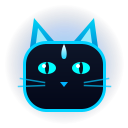

# CatClient

> Fabric 1.21.11 utility client with Blue Flame theme, ImGui UI, and cloud backend.



---

## Features

- **ImGui Interface**: Dark slate background with Blue Flame accents (`#00D2FF`). Press `Right Shift` to open.
- **Combat & Render**:
  - `AimAssist`: Smooth legitimate combat tracking with customizable FOV, part targeting, and ESP.
  - `BlockOverlay`: Animated block outline and fill with customizable colors.
  - `Fullbright`: Gamma and Night Vision modes.
- **HUD Elements**: FPS, CPS, Ping, Keystrokes, Armor, Potion, Scoreboard, Coordinates, Server IP, Reach Display, Arrow/Pot/Totem counters.
- **Utility**: ToggleSprint, ToggleSneak, Zoom, Freelook, HurtCam, HitColor, Hitbox, Nametags, TimeChanger.
- **Cloud Backend**: Connected to `https://catclient-backend.onrender.com` for user badges, capes, and MOTD with idle wake-up detection.

---

## Setup & Building

Building is automated in the cloud via GitHub Actions.

To build manually:
```bash
./gradlew build
```

---

## License

MIT License
